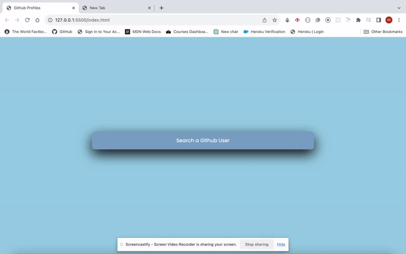

## GitHub Profiles

GitHub Profiles is a web application that allows users to explore and discover GitHub profiles of developers around the world. It provides a simple and intuitive interface to search for users, view their repositories, and learn more about their contributions to the open-source community.

# Features

Search for GitHub users by their username.View detailed profiles of GitHub users, including their avatar, bio, location, and social media links.Browse through the repositories owned by the user, along with repository details such as stars, forks, and last update.
See a user's top repositories based on stars and forks.
Get insights into a user's GitHub activity and contributions.

# Installation

To run GitHub Profiles locally, follow these steps:
`Clone the GitHub Profiles repository:`
`-bash`
`git clone https://github.com/example/github-profiles.git`

`Navigate to the project directory:`

`cd github-profiles`

`Install the required dependencies:`

# Technologies

UsedHTML5, CSS3, and JavaScript

## Contributing

Contributions to GitHub Profiles are always welcome! If you find a bug, have a feature request, or want to contribute improvements, feel free to create an issue or submit a pull request.

Please ensure that your contributions adhere to the existing coding standards and follow the repository's license.
License

GitHub Profiles is licensed under the MIT License.
Acknowledgments

## Contact

If you have any questions or suggestions, you can reach out at the below address:  
[Gmail](masihomer123@gmail.com)  
[GitHub Profiles](OmerMasih)

## Project Demonstration

